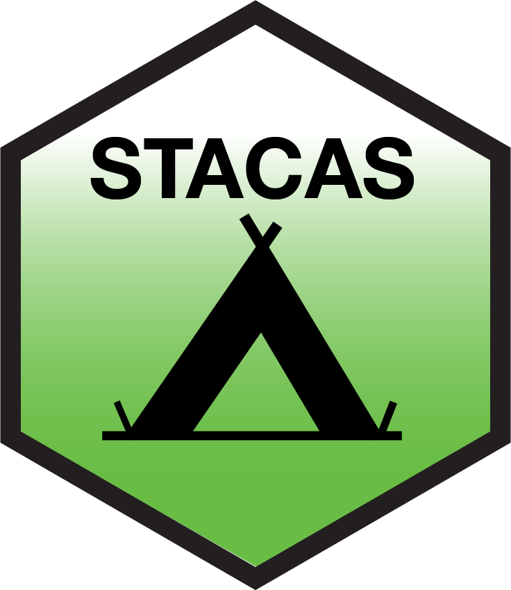

# STACAS: Accurate semi-supervised integration of single-cell transcriptomics data

<p align="center">
  
</p>

 [STACAS](https://github.com/carmonalab/STACAS) is a method for scRNA-seq integration, especially suited to accurately integrate datasets with large cell type imbalance (e.g. in terms of proportions of distinct cell populations).

Prior cell type knowledge, given as cell type labels, can be provided to the algorithm to perform semi-supervised integration, leading to increased preservation of biological variability in the resulting integrated space.

STACAS is robust to incomplete cell type labels and can be applied to large-scale integration tasks.

## Package Installation

To install STACAS directly from the Git repository, run the following code from within RStudio:

```r
if (!requireNamespace("remotes")) install.packages("remotes")
library(remotes)

remotes::install_github("carmonalab/STACAS")
```

## STACAS basic usage
### Standard integration (more [here](https://carmonalab.github.io/STACAS.demo/STACAS.demo.html#one-liner-stacas))
```r
library(STACAS)

# get the test dataset "pbmcsca" from SeuratData package
if (!requireNamespace("remotes")) install.packages("remotes")
if (!requireNamespace("SeuratData")) install_github('satijalab/seurat-data')
library(SeuratData)
library(Seurat)
InstallData("pbmcsca")
data("pbmcsca")

# Integrate scRNA-seq datasets generated in different batches (in this example, using different methods/technologies)
pbmcsca.integrated <- NormalizeData(pbmcsca) |>
    SplitObject(split.by = "Method")|>
    Run.STACAS()

pbmcsca.integrated <- RunUMAP(pbmcsca.integrated, dims = 1:30) 

# Visualize
DimPlot(pbmcsca.integrated, group.by = c("Method","CellType")) 
```

### Semi-supervised integration (more [here](https://carmonalab.github.io/STACAS.demo/STACAS.demo.html#semi-supervised-integration))

```r
pbmcsca.semisup <- NormalizeData(pbmcsca) |>
    SplitObject(split.by = "Method")|>
    Run.STACAS(cell.labels = "CellType")

pbmcsca.semisup <- RunUMAP(pbmcsca.semisup, dims = 1:30) 
```

## STACAS integration DEMOS

Find a tutorial for `STACAS` in a complete Seurat integration pipeline at: [STACAS demo](https://carmonalab.github.io/STACAS.demo/STACAS.demo.html) (code and instructions [here](https://github.com/carmonalab/STACAS.demo))

See also how `STACAS` compares to other computational tools for the integration of heterogeneos data sets: [STACAS vs other tools](https://carmonalab.github.io/STACAS.demo/Tcell.demo.html)


### Citation

* Andreatta M, Herault L, Gueguen P, Gfeller D, Berenstein AJ, Carmona SJ - "Semi-supervised integration of single-cell transcriptomics data", *Nature Communications* **(2024)** - https://www.nature.com/articles/s41467-024-45240-z

* Andreatta M, Carmona SJ - "STACAS: Sub-Type Anchor Correction for Alignment in Seurat to integrate single-cell RNA-seq data", *Bioinformatics* **(2021)** - https://doi.org/10.1093/bioinformatics/btaa755

<p align="center">
  
</p>
